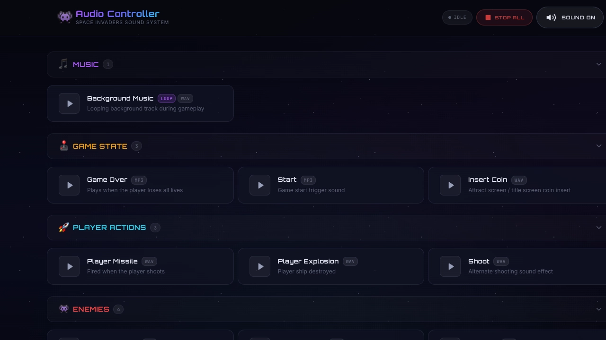
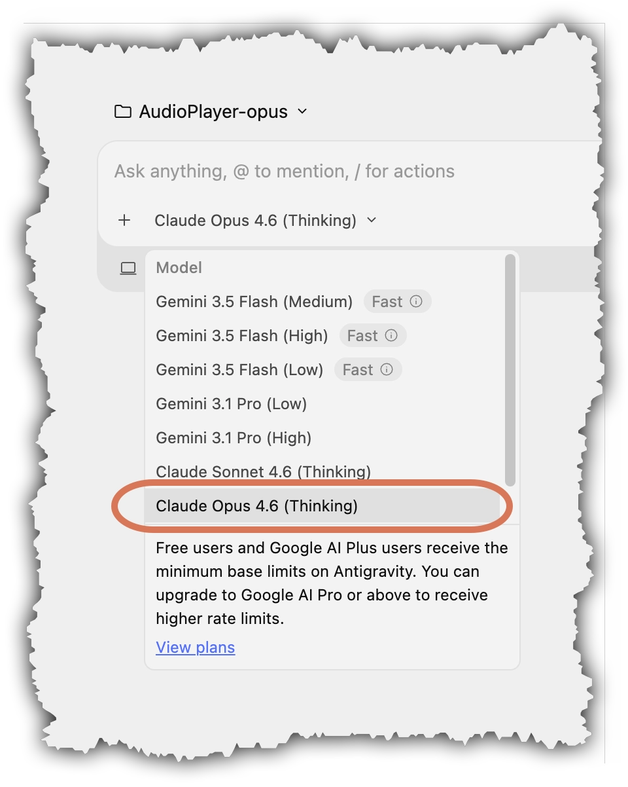
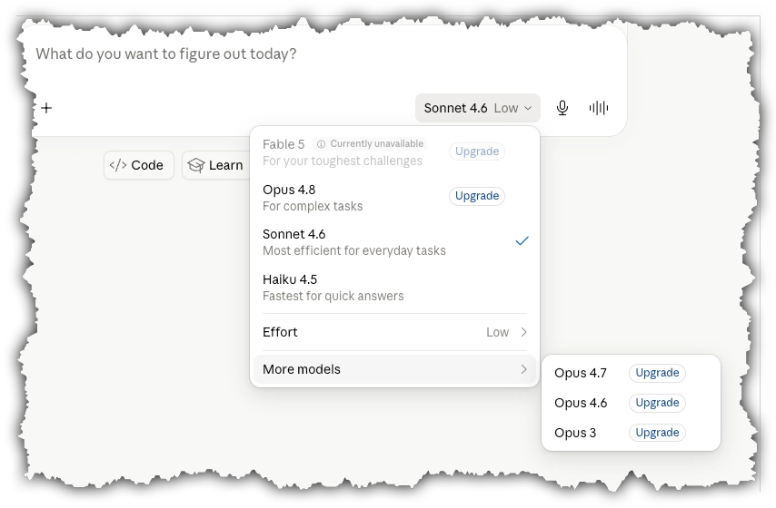
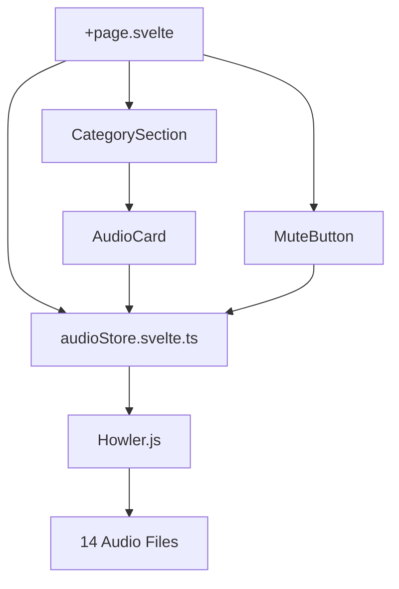

# Leveraging Google's Antigravity and Anthropic's Opus 4.6

## TL;DR

Used Opus 4.7 for free to create this [website](https://audio-controller-green.vercel.app/)

### Screenshot:



## Introduction

My problem involved writing an Audio Controller in Svelte in an elegant fashion. I wanted to eliminate my 'if(okToPlaySound === true)` statements sprinkled throughout my spaghetti code.

If you watch Code with Stanislav's (YouTube video)[https://www.youtube.com/watch?v=nXIMQr12nqw], you will learn that `Opus 4.5` scored 100% with a test harness of 100 problems using a variety of different Svelte 5 runes and other challenging tasks. The score is from Stanislav's (Svelte Benchmark)[https://github.com/khromov/svelte-bench]. The bottom line is Opus 4.5 and greater are extremely capable of generating solid Svelte 5 code.

So I wanted to use Claude Code to attack the problem but didn't want to pay for usage as I am obscenely frugal (*e.g.*, cheap).

## Research

I learned of Google's Antigravity and that it supports llms. You can see here an astonishing capability at no cost initially (today, there are weekly thresholds, *sigh*):



So I had a more than capable llm (4.6 > 4.5, says Captain Obvious) to prompt for a solution and I only used about half of my weekly quota.

## But wait...

You may ask why not just use Opus from within claude.ai? Well, currently you need to upgrade your plan and remember my tightfistedness. Eventually I will upgrade as Claude is just too good not to use.



## Prompt time

Here is the prompt:

`Can you create a sveltekit project that uses the audio files in the folder <username path>/static/audio to show how you would control the audio given the various game states as described by the title of each audio file and produce a user interface with buttons to play each audio file as well as have a mute button to mute/unmute globally.`

And the output is this repository.

## Project output

```
Worked for 50s
```
```
Good, I can see the audio files and the existing SvelteKit project structure. Let me examine the existing project config to understand the setup, then create a new SvelteKit project for this audio controller.
```
```
Now I have a clear picture. This is an existing SvelteKit project with Svelte 5, Tailwind CSS v4, and Howler.js. I'll create a new standalone SvelteKit project for the audio controller. Let me build the implementation plan.
```

```
I've created the implementation plan. Key highlights:
```
```
New project at \~/Documents/Projects/audio-controller (keeps the original project untouched)
14 audio files organized into 6 game state categories (Music, Game State, Player Actions, Enemies, Special, UI)
Howler.js for robust cross-browser audio playback (already used in the original project)
Svelte 5 runes for reactive audio state management
Space-themed UI with glassmorphism cards, neon category accents, animated waveforms, and a global mute toggle
```

```
Please review and let me know if you'd like any changes before I start building!
```

```
Implementation Plan
Implementation plan for a new SvelteKit project that serves as an audio controller for Sapce Invaders game sounds. Covers project scaffolding, audio store with Howler.js, UI components (AudioCard, MuteButton, CategorySection), space-themed design system, ...
```

```
Worked for 5m
```

```
Let me start building! First, I'll create the task list and scaffold the project.

Edited task.md
Ran command: `npx -y sv create --help`
Ran command: `npx -y sv create audio-controller --template minimal --types ts --no-add-ons --install npm`
```

```
The project is scaffolding in the background. While it installs, let me start creating the source files.
```

```
Ran command: `mkdir -p \~/Documents/Projects/audio-controller/static/audio && cp \~/Documents/Projects/chris-space-invaders/static/audio/* \~/Documents/Projects/audio-controller/static/audio/`
```

```
Project scaffolded and audio files copied. Now let me install howler and create all the source files. I'll use subagents to parallelize the work.
```

```
Ran command: `cd \~/Documents/Projects/audio-controller && npm install howler && npm install --save-dev @types/howler`
```

```
Now let me update the task list and create all the source files. I'll create them in parallel where possible.
```
```
Edited task.md
```
```
Now let me create all the source files. I'll start with the CSS design system and audio store, then the components.

Edited app.css
Created audioStore.svelte.ts

```
```
Now let me create all the UI components and the page:

Created AudioCard.svelte
Created MuteButton.svelte
Created CategorySection.svelte

Components created. Now let me create the layout and main page:

Edited +layout.svelte
Edited +page.svelte

All files created. Let me update the task list and fire up the dev server to verify:

Edited task.md
Ran command: `npm run dev`
Used tool: manage_task

The dev server is running at **http://localhost:5174/**. Let me verify the app renders correctly by checking for any build errors:

Viewed task-42.log:1-12

No errors — the app compiled and is running cleanly. Let me now mark the final task as done and create the walkthrough:

Edited task.md
Edited walkthrough.md
```
```
The project is complete and running. Here's a summary:
## ✅ Done — Space Invaders Audio Controller

**Running at:** http://localhost:5174/

The app is a standalone SvelteKit project at `\~/Documents/Projects/audio-controller` with:

- **14 audio files** organized into 6 categories (Music, Game State, Player Actions, Enemies, Special, UI)
- **Click any card** → plays/stops that sound with animated waveform bars
- **Global Mute** button → mutes/unmutes all audio via Howler.js
- **Stop All** button → silences everything at once
- **Live status** → shows how many sounds are currently playing
- **Collapsible categories** → each with an active indicator when sounds are playing
- **Background Music** loops automatically; all others are one-shot

The UI features a dark space-themed design with a starfield background, glassmorphism cards, category-colored neon accents (purple for Music, amber for Game State, cyan for Player, red for Enemies, green for Special, indigo for UI), and micro-animations throughout. Check the walkthrough for the full file breakdown.

```
Tasks
 Scaffold SvelteKit project at \~/Documents/Projects/audio-controller
 Copy audio files from source project
 Install howler dependency
 Create design system (src/app.css)
 Create audio store (src/lib/stores/audioStore.svelte.ts)
 Create AudioCard component
 Create MuteButton component
 Create CategorySection component
 Create root layout (+layout.svelte)
 Create main page (+page.svelte)
 Verify — run dev server and test
```
```
# Walkthrough — Space Invaders Audio Controller

## What was built

A standalone SvelteKit project at `\~/Documents/Projects/audio-controller` that provides an interactive UI to play and control all 14 audio files from the Space Invaders game, organized by game state category.

## Architecture



## Files Created

| File | Purpose |
|------|---------|
| [app.css](file://\~/Documents/Projects/audio-controller/src/app.css) | Space-themed design system with CSS custom properties, starfield background, glassmorphism, and animations |
| [audioStore.svelte.ts](file://\~/Documents/Projects/audio-controller/src/lib/stores/audioStore.svelte.ts) | Svelte 5 runes-based store managing all Howl instances, mute state, and playing state |
| [AudioCard.svelte](file://\~/Documents/Projects/audio-controller/src/lib/components/AudioCard.svelte) | Individual sound card with play/stop toggle, waveform animation, and category-colored accents |
| [MuteButton.svelte](file://\~/Documents/Projects/audio-controller/src/lib/components/MuteButton.svelte) | Global mute/unmute toggle with animated speaker icons |
| [CategorySection.svelte](file://\~/Documents/Projects/audio-controller/src/lib/components/CategorySection.svelte) | Collapsible section grouping AudioCards by game state category |
| [+layout.svelte](file://\~/Documents/Projects/audio-controller/src/routes/+layout.svelte) | Root layout with global styles and meta tags |
| [+page.svelte](file://\~/Documents/Projects/audio-controller/src/routes/+page.svelte) | Main page assembling header, categories, and footer |

## Audio Categories

| Category | Color | Sounds |
|----------|-------|--------|
| 🎵 Music | Purple | Background Music (loops) |
| 🕹️ Game State | Amber | Game Over, Start, Insert Coin |
| 🚀 Player Actions | Cyan | Player Missile, Player Explosion, Shoot |
| 👾 Enemies | Red | Invader Shoot, Invader Walk, Explode, Bomb |
| ✨ Special | Green | Spaceship, Bonus |
| 🎮 UI | Indigo | Select |

## Key Features

- **Click any card** to play/stop that sound
- **Global mute** toggles all audio via Howler.js
- **Stop All** button in header stops every playing sound
- **Active indicator** shows which categories have playing sounds
- **Status pill** shows count of currently playing sounds
- **Collapsible sections** to organize the 14 sounds
- **Background Music** auto-loops; all others are one-shot
- **Animated waveform bars** appear on actively playing cards

## Verification

- ✅ Dev server runs cleanly with no build errors
- ✅ All 14 audio files copied to `static/audio/`
- ✅ App available at http://localhost:5174/
```

## End of output


## Dénoûment 

The audio controller code helped move my Space Invaders project forward and presented me with more elegant code than I was generating. For example, my mute button calls one function and either turns the volume off or on globally. For a given audio file, I just play it based upon the game state, no more `if (okToPlaySound === true)` statements as the volume is either on or off globally. I just play the audio file and if the volume (or gain in `Howler.js`) is on then you hear the sound, if not then silence. So simple in hindsight. 

Thanks, Opus!


